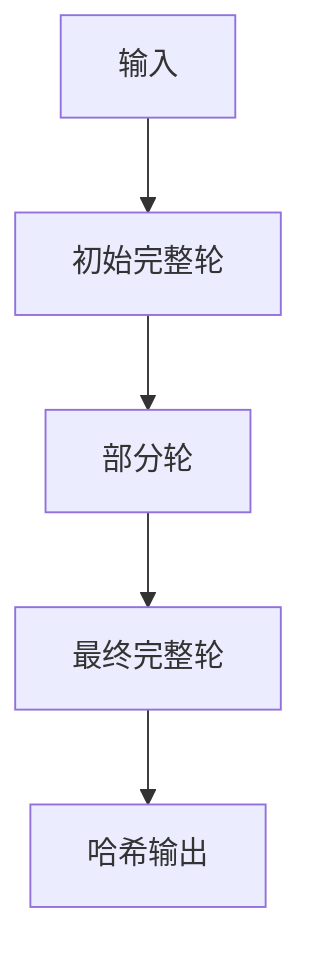

# Poseidon2哈希算法电路实现实验报告

## 1. 实验概述
本实验实现了基于Circom的Poseidon2哈希算法电路，采用`(n,t,d)=(256,3,5)`参数配置。Poseidon2是一种零知识证明友好的哈希函数，具有计算效率高、约束数少的特点。

## 2. 技术参数

| 参数        | 值   | 说明               |
|------------|------|--------------------|
| n          | 256  | 哈希输出位数       |
| t          | 3    | 输入元素个数       |
| d          | 5    | S-box幂次          |
| R_f        | 8    | 完整轮数           |
| R_P        | 57   | 部分轮数           |
| 安全级别    | 128位| 密码学安全强度     |

## 3. 实现架构
### 3.1 电路结构图



### 3.2 核心组件

- **S-box层**: `x^5` 运算  
- **MDS矩阵**: 3×3的扩散矩阵  
- **轮常数**: 预计算的随机常数  
- **轮函数**:  
  - 完整轮：所有元素都经过S-box  
  - 部分轮：仅第一个元素经过S-box  

---

## 4. 性能指标

### 4.1 约束统计

```bash
snarkjs info -r build/poseidon2.r1cs
```

输出示例
```bash
# Wires: 12458
# Constraints: 8321 
# Public Inputs: 3
# Outputs: 1
```

## 4.2 基准测试

| 操作          | 耗时(ms) |
|---------------|---------|
| 电路编译      | 1420    |
| Witness生成   | 86      |
| 约束验证      | 32      |
