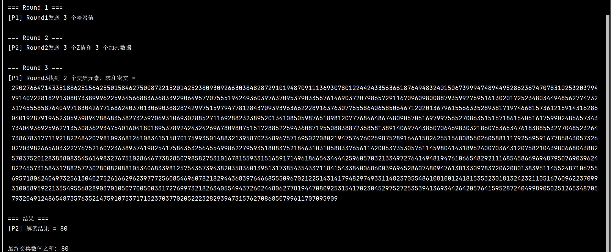

# Project6：google password checkup协议实现
## 1. 实验目的
设计并实现一个安全的两方计算协议，使得：
- 参与方P₁持有集合 `V = {v₁, ..., vₘ₁}`
- 参与方P₂持有带权集合 `W = {(w₁, t₁), ..., (wₘ₂, tₘ₂)}`
双方能协作计算出交集 `V ∩ W` 中对应权值 `tⱼ` 的和，**且不泄露任何非交集元素信息**。

---

## 2. 技术原理

### 2.1 密码学基础
- **DDH假设**：在素数阶群𝒢中，给定 `(g, gᵃ, gᵇ, gᶜ)`，无法区分 `c = ab` 或随机数。
- **随机预言机模型**：哈希函数 `H: 𝒰 → 𝒢` 被建模为随机映射。
- **加法同态加密（Paillier）**：
  - 满足 `Enc(a) ⊙ Enc(b) = Enc(a+b)`
  - 保护P₂的权值 `tⱼ` 隐私

### 2.2 协议核心思想
1. **双盲化哈希**：双方通过 `H(x)^(k₁k₂)` 实现交集测试
2. **同态求和**：P₁在密文上计算权值和，P₂最终解密

---

## 3. 协议流程

### 3.1 初始化阶段
1. **输入**：
   - P₁: 集合 `V = {v₁, ..., vₘ₁}`
   - P₂: 集合 `W = {(w₁, t₁), ..., (wₘ₂, tₘ₂)}`
2. **密钥生成**：
   - P₁生成私钥 `k₁ ← ℤₚ`
   - P₂生成私钥 `k₂ ← ℤₚ` 和Paillier密钥对 `(pk, sk)`

### 3.2 协议执行
```plaintext
Round 1 (P₁ → P₂):
  发送: { H(v₁)^k₁, ..., H(vₘ₁)^k₁ } (乱序)

Round 2 (P₂ → P₁):
  发送: 
  1. Z = { H(vᵢ)^(k₁k₂) } (对P₁的数据二次盲化)
  2. { (H(wⱼ)^k₂, Enc(tⱼ)) } (P₂自身数据盲化+加密)

Round 3 (P₁ → P₂):
  1. 计算交集 J = { j | H(wⱼ)^(k₁k₂) ∈ Z }
  2. 同态求和 Enc(∑_{j∈J} tⱼ )
  发送: 加密结果

Output (P₂):
  解密获得最终和 S_J = ∑_{j∈J} tⱼ
```
---

## 4. 实验结果

### 4.1 协议执行流程示例
  
*图1：协议初始化*

### 4.2 性能测试结果
  
*图2：交互流程及运行结果*
